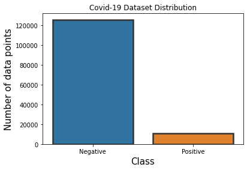
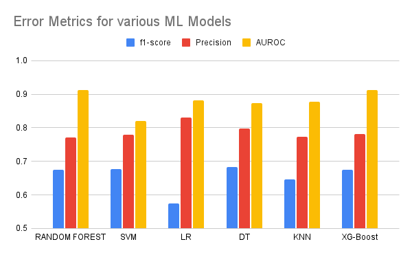
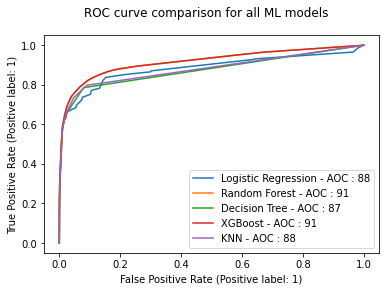

# Covid-19 diagnosis prediction based on symptoms
---
Prediction of covid-19 based on the symptoms of patient
[Link](https://data.gov.il/dataset/covid-19)

## Dataset Description 
---
-   Phisiological Factors

    -   Gender ( Male /Female )

    -   Age above 60

-   Medical Symptoms

    -   Cold

    -   Cough

    -   Fever

    -   Sore Throat

    -   Shortness of Breath

    -   Headache

-   Other Features

    -   Contact with Covid-19 , or travel from abroad

-   Result

    -   Test Result of the patient for Covid-19

## ML Models used for Prediction
---
- Support Vector Machine Classification (SVM)
- Lorgistic Regression ( Classification )
- k-Nearest Neighbours Classification (kNN)
- Decision Trees Classifier
- Random Forest Classifier
- XG-Boost Classifier
- Gradient Boosting Classifier

## DataCleanup 
---
All the data points used in this analysis are binary type
values. All String values in the dataset are appropriately
transformed into 0’s and 1’s before training. After cleaning
up the data with incomplete features, we had around 170K
data points which are used for testing and training purposes.

## Metrics used for Comparision
---
- Accuracy   - Correctness of the prediction
	- f1-score-score   - Harmonic mean of precision and recall
	- precision   - How low is the miscassification( False positive) 
	- recall      - How much of positive has beeb detected as positive
	- roc\_auc  - Area under the ROC curve 
the dataset is unbalanced. so using accuracy as an error metric would not be a proper choice for this unbalanced dataset. For these kinds of problems with unbalanced datasets, we can either f1-score score or the Area under the ROC curve( AUROC ).In this project, we have used AORUC as an error metric to validate the performance of our models

## Experimentation
---

All models are modelled with two fold cross validation. WE have used the `gridsearchCV` available in the scikit-learn library to optimise the hyper parameters

## Validation of Models
---

### 1. SVM

#### Hyper Parameters Optimisation

- Kernel Function -  linear , rbg 
- C - 0.1-1

Best Performed: c = 1, Kernel = Linear

| **Error Metric** | **Train**    | **Test**     |
|--------------|----------|----------|
| Acccuracy    | 0.958736 | 0.955266 |
| f1-score     | 0.693835 | 0.676758 |
| Precision    | 0.817031 | 0.77853  |
| AUROC        | 0.823634 | 0.820783 |

### 2. Random Forest

#### Hyper Parameters Optimisation

- n_estimators -  [50, 100, 200, 300]
- model_max_features -  [′auto′,′ sqrt′,′ log2′]

Best Performed: n_estimator = 50, feature = sqrt

| **Metric**    | **Train**    | **Test**     |
|-----------|----------|----------|
| Acccuracy | 0.958839 | 0.954613 |
| f1-score  | 0.695819 | 0.674669 |
| Precision | 0.814304 | 0.771598 |
| AUROC     | 0.915274 | 0.911641 |

### 3. Logistic Regression

#### Hyper Parameters Optimisation

- penalty : [′l1′,′ l2′,′ none′]
- Solver -  [′newton − cg′,′ lbf gs′,′ liblinear′
-  C : [100, 10, 1, 0.1]

Best Performed:  penalty : ’l2’ and
C : 0.1

| **Metric**    | **Train**    | **Test**     |
|--------------|----------|----------|
| Acccuracy             | 0.950783 | 0.949756 |
| f1-score              | 0.583085 | 0.57461  |
| Precision             | 0.848714 | 0.830029 |
| AUROC                 | 0.881217 | 0.880958 |

### 4. Decision Trees

#### Hyper Parameters Optimisation

- max depth : [3, 4, 5, 6]
-  min samples leaf :
[1, 2, 3]
-   max leaf nodes : [5, 10]

Best Performed:  max depth
: ’5’, min samples leaf : ’1’ and max leaf nodes : ’10’

| **Metric**    | **Train**    | **Test**     |
|--------------|----------|----------|
| Acccuracy             | 0.957005 | 0.955273 |
| f1-score              | 0.957005 | 0.682392 |
| Precision             | 0.798733 | 0.798733 |
| AUROC                 | 0.873675 | 0.87355  |

### 5. k-Nearest Neighbours Classifier

#### Hyper Parameters Optimisation

- metric :
[′euclidean′,′ manhattan′,′ minkowski′]
- n neighbors :
[3, 5, 10]
-  p : [1, 2, 3]

Best Performed:   metric : ’euclidean’
, n neighbors : ’10’ and p : ’1’ 

| **Metric**    | **Train**    | **Test**     |
|--------------|----------|----------|
| Acccuracy             | 0.956469 | 0.951935 |
| f1-score              | 0.671162 | 0.645435 |
| Precision             | 0.77256  | 0.77256  |
| AUROC                 | 0.880989 | 0.878335 |

### 6. XG Boost

#### Hyper Parameters Optimisation

- num leaves : [50, 100, 200
- feature fraction :
[0.1, 0.2, 0.33]
-  num boost round : [200, 300, 400]
  

Best Performed:  num leaves : ’50’ , feature fraction : ’0.1 ’ and
num boost round : ’ 200’ got the optimal valu

| **Metric**    | **Train**    | **Test**     |
|--------------|----------|----------|
| Acccuracy             | 0.958773 | 0.955185 |
| f1-score              | 0.693286 | 0.674568 |
| Precision             | 0.781395 | 0.781395 |
| AUROC                 | 0.915021 | 0.912753 |

## Results
---

### f1-Score & Precision

### AUROC

### Confusion Matrix for XGBoost

## Inference
---
The XGBoost model seem
to be best performing for the current dataset with given
parameters. Both Random forest and XGboost were seem
to be giving same AUROC value, however the XGBoost had
slightly higher precision. Further it could also be observed
that both models which provided higher AUROC score are
Ensemble based models

